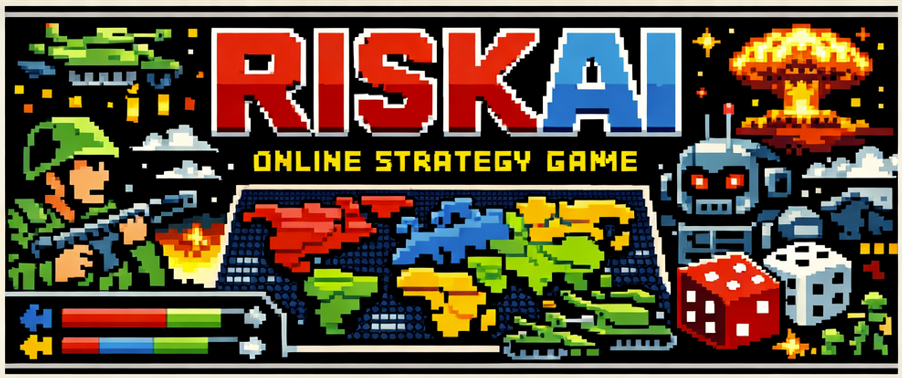

<p align="center">
  
</p>

# 🌍 RiskAI - World Domination

A modern web-based implementation of the classic Risk board game with CPU opponents, AI agent support via MCP (Model Context Protocol), and real-time multiplayer — built with the latest Java technologies.

> **📖 Looking for gameplay instructions?** See [HOW-TO-PLAY.md](HOW-TO-PLAY.md)

## ✨ Features

- **Multiplayer Support** — Create games and invite friends to join
- **CPU Players** — Play against computer opponents (Easy, Medium, Hard)
- **AI Agent Players** — AI agents (e.g. GitHub Copilot) can join and play via the MCP server
- **Game Modes** — Classic (eliminate all), Domination (control X%), Turn Limit (most territories after N turns)
- **Multiple Maps** — Classic World (42 territories), Europe (24 territories) and more
- **Real-time Updates** — WebSocket-based live game state broadcasting
- **Interactive Map** — SVG-based map with clickable territories
- **Spectator Mode** — Watch ongoing games without participating

## 🛠️ Technology Stack

| Layer | Technology | Version |
|-------|-----------|---------|
| Language | Java | 25 |
| Framework | Spring Boot | 4.0.2 |
| Real-time | Spring WebSocket (STOMP/SockJS) | — |
| AI Integration | Spring AI MCP Server | 2.0.0-M2 |
| Templating | Thymeleaf | — |
| Database | H2 (dev) / PostgreSQL (prod) | — |
| Serialization | Jackson 3 | — |
| UI | Bootstrap 5 | — |
| Build | Maven (or Maven Wrapper) | 3.9+ |

## 🚀 Getting Started

### Prerequisites

- **Java 25 or higher** — always required (unless using Docker)
- **Maven 3.9+** — optional; the project includes a Maven Wrapper (`mvnw` / `mvnw.cmd`) that downloads Maven automatically if it is not installed

### Run

#### Option 1 — Maven Wrapper (no Maven installation required)

Windows:
```cmd
.\mvnw.cmd spring-boot:run
```

Linux / macOS:
```bash
./mvnw spring-boot:run
```

#### Option 2 — Maven (if already installed)

```bash
mvn spring-boot:run
```

#### Option 3 — Pre-built JAR (if you have already run `mvn package`)

```bash
java -jar target/riskai-game-1.0.0-SNAPSHOT.jar
```

Open http://localhost:8080 in your browser.

### Docker

Build the image:

```bash
docker build -t riskai .
```

Run the container:

```bash
docker run -d -p 8080:8080 --name riskai riskai
```

With memory limit (JVM auto-adjusts via `MaxRAMPercentage`):

```bash
docker run -d -p 8080:8080 -m 512m --name riskai riskai
```

Useful commands:

```bash
docker logs -f riskai    # View logs
docker stop riskai       # Stop
docker rm riskai         # Remove
```

### Connecting the MCP Server to an AI Client

The MCP server exposes game tools over Streamable HTTP at `/mcp`. To connect an AI agent, add the server to your client's MCP configuration.

#### VS Code (GitHub Copilot)

Add to your `.vscode/mcp.json` (or user `settings.json` under `mcp`):

```json
{
  "servers": {
    "riskai": {
      "type": "http",
      "url": "http://localhost:8080/mcp"
    }
  }
}
```

#### Claude Desktop

Add to your `claude_desktop_config.json`:

```json
{
  "mcpServers": {
    "riskai": {
      "type": "streamable-http",
      "url": "http://localhost:8080/mcp"
    }
  }
}
```

#### Any MCP-compatible Client

Point the client to the Streamable HTTP endpoint:

```
URL: http://localhost:8080/mcp
Transport: Streamable HTTP
```

Once connected, the AI agent can discover and call all game tools (join games, place armies, attack, etc.) through the MCP protocol.

## 📐 Project Structure

```
src/main/java/com/riskai/
├── config/          # Spring configuration (security, async, websocket, maps, MCP)
├── controller/      # REST and web controllers
├── cpu/             # CPU player strategies (Easy, Medium, Hard)
├── dto/             # Data Transfer Objects
├── exception/       # Global exception handling
├── mcp/             # MCP tool service for AI agents
├── model/           # JPA entities and enums
├── repository/      # Spring Data JPA repositories
├── service/         # Business logic services
└── websocket/       # WebSocket handlers for real-time communication

src/main/resources/
├── maps/            # Map definitions (classic-world.json, europe.json)
├── static/          # CSS and JavaScript
├── templates/       # Thymeleaf HTML templates
├── application.yml  # Default configuration
└── application-prod.properties  # Production overrides
```

## 🔧 Configuration

### application.yml

```yaml
server:
  port: 8080

game:
  maps-directory: maps         # Map files location
  max-players: 6               # Maximum players per game
  min-players: 2               # Minimum players to start
  cpu:
    think-delay-ms: 3000       # CPU decision delay (ms)
    default-difficulty: MEDIUM  # EASY, MEDIUM, HARD

spring:
  ai:
    mcp:
      server:
        name: riskai-mcp-server
        version: 1.0.0
        protocol: STREAMABLE
        streamable-http:
          mcp-endpoint: /mcp
```

## 🔌 API Reference

### REST API (`/api/games`)

| Method | Endpoint | Description |
|--------|----------|-------------|
| GET | `/api/games/maps` | List available maps |
| GET | `/api/games` | List all games (`?joinableOnly=true` to filter) |
| POST | `/api/games` | Create a new game |
| GET | `/api/games/{id}` | Get game state |
| POST | `/api/games/{id}/join` | Join a game |
| POST | `/api/games/{id}/cpu` | Add a CPU player |
| POST | `/api/games/{id}/start` | Start the game |
| POST | `/api/games/{id}/reinforce` | Place armies |
| POST | `/api/games/{id}/attack` | Attack a territory |
| POST | `/api/games/{id}/endAttack` | End attack phase |
| POST | `/api/games/{id}/fortify` | Move armies |
| POST | `/api/games/{id}/skipFortify` | Skip fortify phase |

### MCP Server (`/mcp`)

The MCP Streamable HTTP endpoint exposes game operations as tools for AI agents:

| Tool | Description | Session Required |
|------|-------------|:---:|
| `listJoinableGames` | List available games | No |
| `listAllGames` | List all games | No |
| `getGameState` | Full game state | No |
| `getAttackableTargets` | Valid attack targets from a territory | No |
| `getPlayerTerritories` | Player's territories with army counts | Yes |
| `getMyTurnStatus` | Check turn status and available actions | Yes |
| `waitForMyTurn` | Long-poll until it's your turn | Yes |
| `joinGame` | Join a game (returns session token) | No |
| `placeArmies` | Place reinforcement armies | Yes |
| `attack` | Attack enemy territory | Yes |
| `endAttackPhase` | End attack phase | Yes |
| `fortify` | Move armies between territories | Yes |
| `skipFortify` | Skip fortification | Yes |

## 📝 License

This project is for educational purposes. Risk is a trademark of Hasbro. RiskAI is a fan project.
